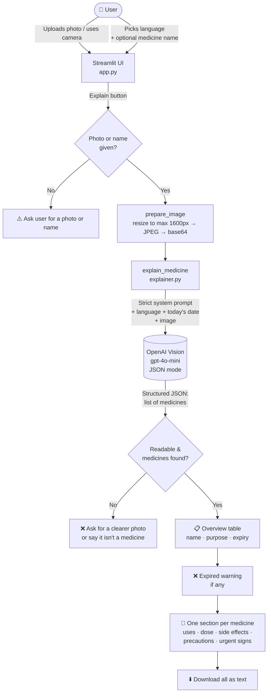

# 💊 AI Medicine Label Explainer

Snap or upload a photo of a **medicine strip, bottle, prescription or pharmacy bill** and get every medicine on it explained in simple words — in **English, Tamil, Hindi, Telugu, Malayalam or Kannada**.

Built for ordinary people (especially elderly patients and their families) who struggle to read small print or understand medical terms.

> ⚠️ For general information only — not medical advice. Always follow your doctor or pharmacist.

**Tech:** Python · Streamlit · OpenAI Vision (`gpt-4o-mini`) · Pillow · Docker

---

## ✨ Features

- 📷 **Upload or camera** — works with a phone camera (needs HTTPS when deployed)
- 🧾 **Reads every medicine at once** — bills and prescriptions with many items are explained in one go
- 📋 **Overview table** — every medicine, what it's for and its expiry date at a glance
- ❌ **Expiry check** — flags medicines that are already expired
- 🗣️ **6 languages** — medicine and ingredient names stay in English so they match the strip
- 🛡️ **Safety rules** — never invents a dose, never diagnoses, rejects blurry or non‑medicine photos
- ⬇️ **Download** — the full explanation as a text file to share on WhatsApp
- ✍️ **No photo?** — type a medicine name (e.g. `Dolo 650`) and get it explained

For each medicine you get: what it's used for · how to take it · common side effects · precautions · do not take if · see a doctor urgently if · storage · expiry.

---

## 🔄 How it works



### Step by step

1. **Input** — the user uploads a photo (or takes one with the camera), picks a language, and can optionally type the medicine name.
2. **Image prep** — `prepare_image()` shrinks the photo to max 1600 px and converts it to a base64 JPEG. Smaller image = faster and cheaper API call, still sharp enough for small print.
3. **AI reading** — `explain_medicine()` sends the image with a strict system prompt to OpenAI Vision using `response_format=json_object`, so the reply is always valid JSON containing a list of every medicine found.
4. **Display** — `app.py` turns the JSON into an overview table, expiry warnings, and an expandable section per medicine, plus a download button.

### Response format

```json
{
  "readable": true,
  "message": "",
  "document_type": "Pharmacy bill",
  "medicines": [
    {
      "medicine_name": "Calpol",
      "strength": "500 mg",
      "active_ingredients": ["Paracetamol"],
      "summary": "Used for fever and pain.",
      "used_for": [], "how_to_take": [], "common_side_effects": [],
      "precautions": [], "do_not_take_if": [], "see_doctor_urgently_if": [],
      "storage": "", "expiry_date": "04/2024", "expired": true
    }
  ]
}
```

---

## 📁 Project structure

```
medicine-label-explainer/
├── app.py                 # Website UI (Streamlit)
├── explainer.py           # AI logic: image prep, prompt, JSON parsing, text report
├── requirements.txt
├── .env.example           # copy to .env and add your key
├── .streamlit/config.toml # upload limit + theme
├── Dockerfile
├── docker-compose.yml
├── samples/               # test images (strip, syrup, prescription, blurry, non-medicine)
└── .gitignore / .dockerignore
```

---

## 🚀 Run locally (Windows)

```powershell
git clone https://github.com/Hariharan17194/medicine-label-explainer.git
cd medicine-label-explainer
python -m venv venv
venv\Scripts\activate
pip install -r requirements.txt
copy .env.example .env      # then open .env and paste your OpenAI key
streamlit run app.py
```

Open http://localhost:8501 and try the images in `samples/`.

## 🐳 Run with Docker

```bash
cp .env.example .env        # add your OpenAI key
docker compose up -d --build
```

Open http://localhost:8502 (or `http://YOUR_VPS_IP:8502` on a server). Put it behind Nginx + HTTPS so the phone camera works.

---

## 🧪 Test images

| File | Expected result |
|---|---|
| `samples/1_tablet_strip_paracetamol.jpg` | Full explanation, dose = "follow your doctor" |
| `samples/2_syrup_bottle_cough.jpg` | Dose repeated from the label |
| `samples/3_prescription.jpg` | All 3 medicines explained with timings |
| `samples/4_blurry_strip.jpg` | Asks for a clearer photo |
| `samples/5_not_medicine_grocery.jpg` | Says it is not a medicine |

---

## 🔒 Privacy

Photos are sent to OpenAI only to read the label. They are not stored by this app. Your API key lives in `.env`, which is never committed.

## 🗺️ Ideas for v2

- Medicine reminders (WhatsApp / Telegram via n8n)
- Voice read‑out in Tamil (text‑to‑speech)
- Check if two medicines are safe together
- Save history per user

---

Made by **Hariharan Padmanabhan** · [github.com/Hariharan17194](https://github.com/Hariharan17194)
